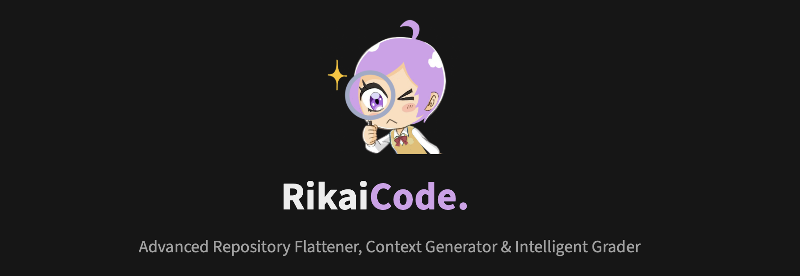
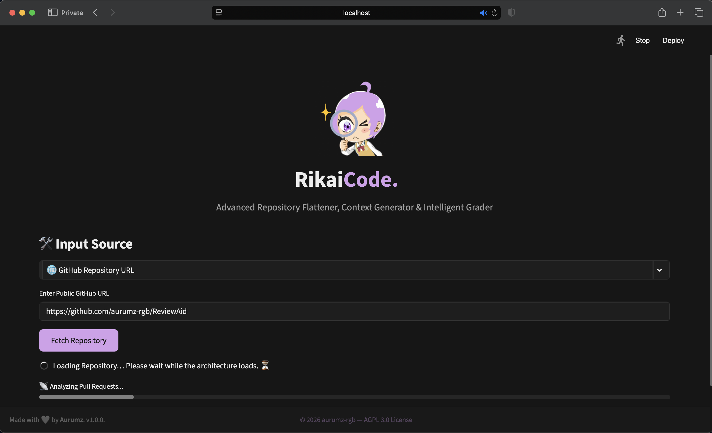
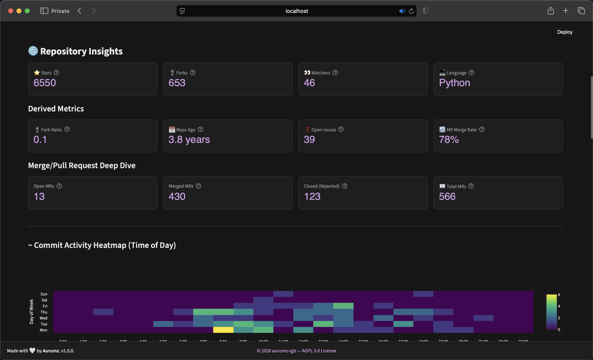
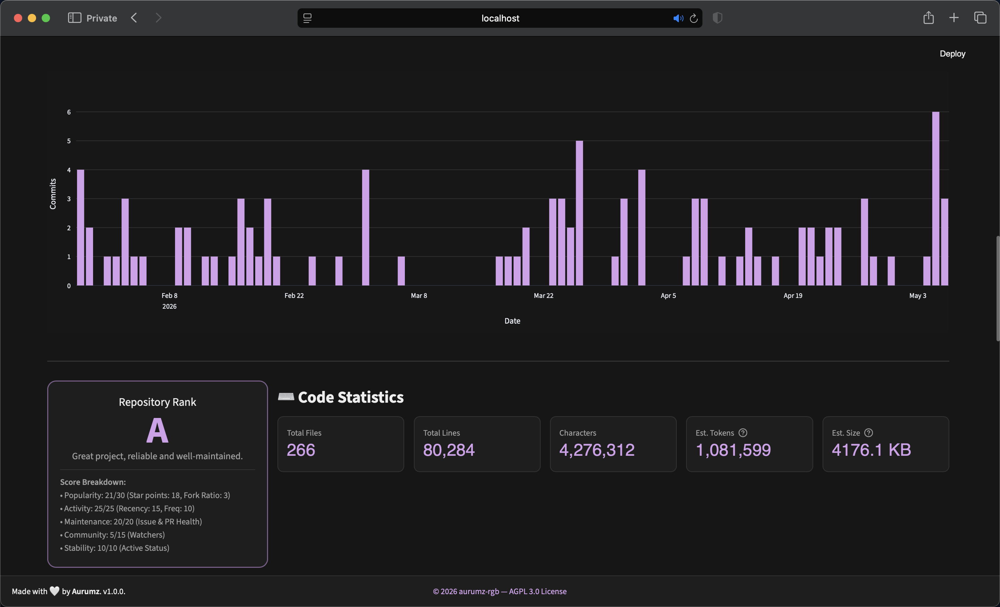
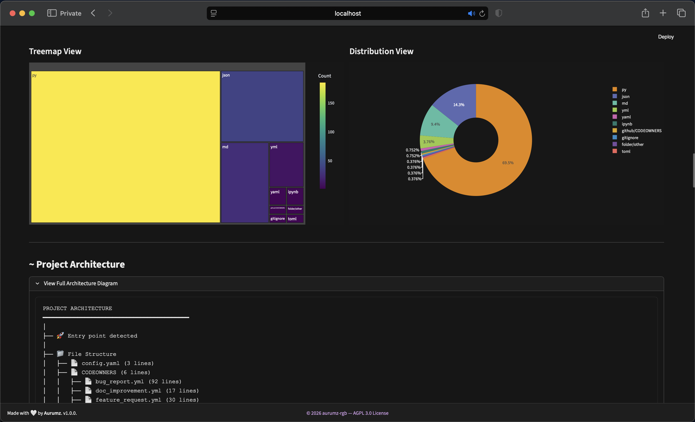
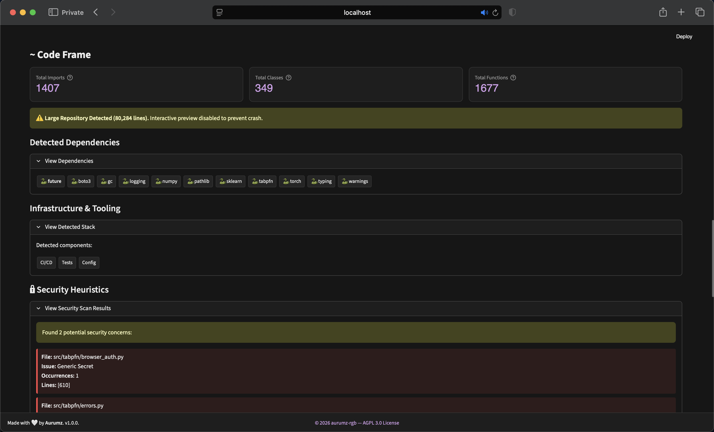
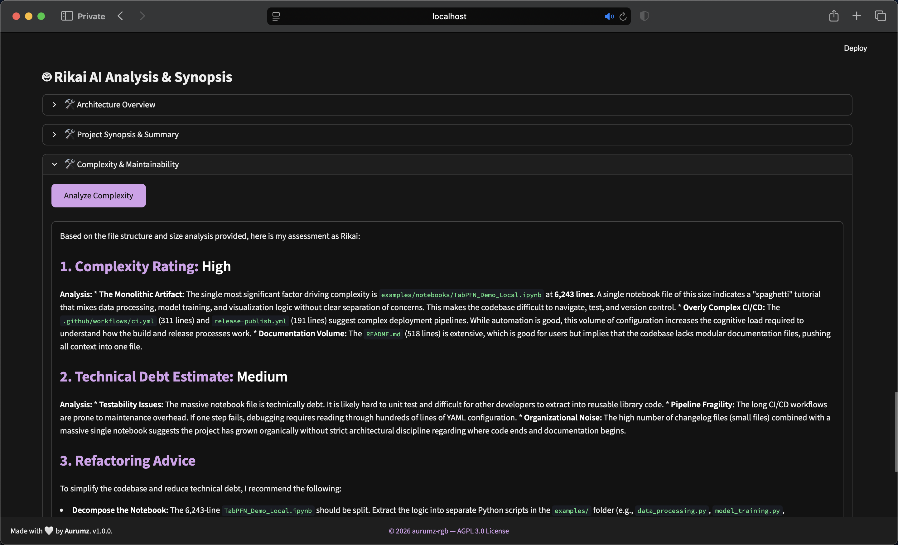
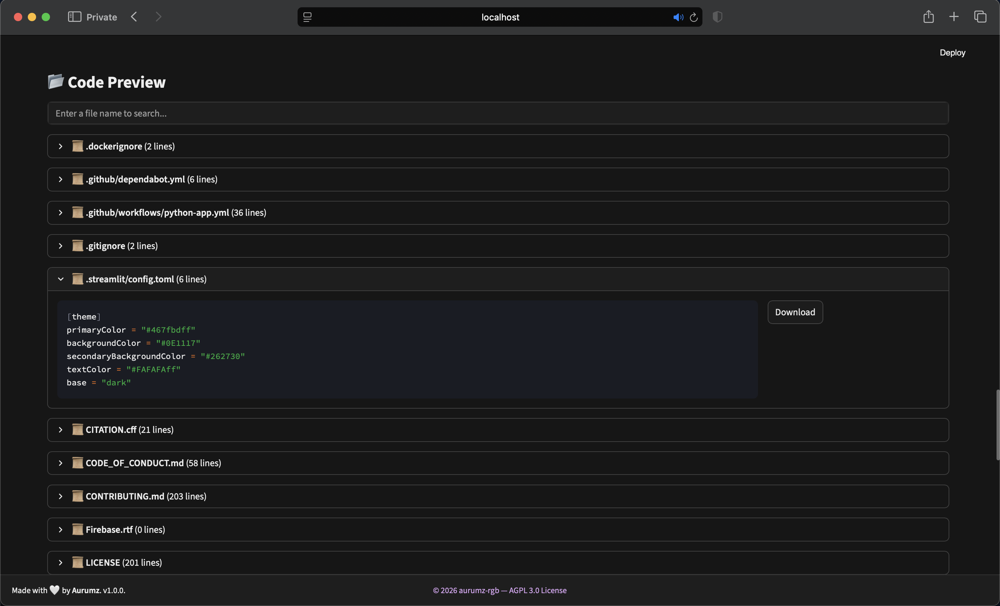

*Flattening for AI, Context for understanding, and Grading for quality.*

RikaiCode is a sophisticated, browser-based tool designed to turn complex codebases into structured, actionable data. Whether you need to feed code into an LLM, audit a project's quality, or simply understand a new architecture, RikaiCode provides the insights you need in a beautiful, dark-themed interface.


[](https://github.com/ellerbrock/open-source-badges/)

---

## ✨ Key Features

### 1. Multi-Source Input
Seamlessly analyze public **GitHub** or **GitLab** repositories, or upload local files and **ZIP** folders. It handles large repositories by automatically skipping binary files and non-text assets to ensure optimal performance.

### 2. Intelligent Grading System
RikaiCode assigns a unified grade (**A++ to C**) to every project. This isn't just a random score; it's calculated using a weighted algorithm based on industry standards for software health.

### 3. AI-Powered Analysis (Rikai AI)
Integrated with the **GLM-4.7-Flash** model, RikaiCode acts as your personal code architect. It can summarize entire projects, explain complex functions, and generate onboarding guides.

### 4. Security Heuristics
Automatically scans code for potential vulnerabilities, including:
- Hardcoded AWS Access Keys.
- Generic API Keys/Secrets.
- Private SSH Keys (RSA, DSA, EC, OpenSSH).

### 5. Visual Insights
Transforms raw git data into interactive visualizations:
- **Treemaps:** File extension distribution.
- **Pie Charts:** Code composition.
- **Heatmaps:** Commit activity by hour and day of the week.

### 6. One-Click Export
Export your entire flattened codebase into a single file for LLM context. Supported formats: **TXT, JSON, PDF, DOCX, HTML, Markdown, LaTeX**.


---


## 📖 How to Use


1. **Select Source:** Choose between GitHub URL, GitLab URL, or Upload Files.
2. **Analyze:** 
   - If using a URL, click "Fetch Repository".
   - If uploading, drag and drop your files.
3. **Explore:** View the repository grade, architecture diagram, security alerts, and code statistics.
4. **AI Insights:** Expand the "Rikai AI Analysis" section to generate architectural summaries.
5. **Export:** Use the export buttons at the bottom to download the flattened context.


---

## 📸 Screenshots

*The following preview screenshots showing all the availbale features.* 
 
 
 
 
 

*AI-generated architecture summary / code review and Repository code Flattener.* 
 
 


---


##  How It Works: The Grading Logic

RikaiCode uses a **100-point scoring system**. The grade is determined by summing points across five key categories. The system switches between **Remote Analysis** (for GitHub/GitLab) and **Static Analysis** (for local files).

### 🌐 Remote Repository Scoring (GitHub/GitLab)

| Category | Weight | Criteria & Calculation |
| :--- | :---: | :--- |
| **Popularity** | **30 pts** | Based on Stars (0-20 pts) and Fork Ratio (0-10 pts). High stars indicate trust; a healthy fork ratio implies utility. |
| **Activity** | **25 pts** | Measures Recency (0-15 pts) and Commit Frequency (0-10 pts). Recent commits score higher. |
| **Maintenance** | **20 pts** | Analyzes Open Issues Ratio and PR/MR Merge Rate. Low open issues and high merge rates indicate active maintenance. |
| **Community** | **15 pts** | Based on the number of Watchers. Higher watchers mean more community interest. |
| **Stability** | **10 pts** | Penalizes archived repositories. Active projects get full points. |

### 📁 Static Code Scoring (Local Files/Uploads)

| Category | Weight | Criteria & Calculation |
| :--- | :---: | :--- |
| **Documentation** | **30 pts** | Checks for README files (10 pts) and Comment Density (20 pts). Higher comment-to-code ratios score better. |
| **Structure** | **30 pts** | Modularity (avg lines per file) and Organization (presence of entry points like `main.py` or `index.js`). |
| **Best Practices** | **20 pts** | Presence of dependency files (15 pts) and `.gitignore` (5 pts). |
| **Scale** | **10 pts** | Total lines of code. Larger, mature projects score slightly higher. |
| **Stability** | **10 pts** | Based on file count. More files often imply a structured, multi-module project. |

### Grade Breakdown
- **A++ (95+):** Exceptional quality, highly active, massive community trust.
- **A+ (90-94):** Excellent project, strong metrics.
- **A (80-89):** Great project, reliable.
- **B+ (70-79):** Good, but might lack activity or popularity.
- **B (60-69):** Fair quality.
- **C+ (50-59):** Average, potential maintenance issues.
- **C (<50):** Low score, use with caution.

---

## 🤖 AI Features Deep Dive

RikaiCode leverages the **GLM-4.7-Flash** model to provide intelligent insights that go beyond simple statistics.

| AI Feature | Description |
| :--- | :--- |
| **Architecture Overview** | Analyzes the file tree and README to identify the architectural pattern (e.g., MVC, Microservices) and summarize the project's purpose. |
| **Project Synopsis** | Generates an "Executive Summary" including the problem statement, target audience, and key features. Perfect for quickly understanding a new codebase. |
| **Interactive Code Review** | Select any file to receive a detailed review covering strengths, improvements, security checks, and style tips. |
| **Function Explainer** | Specifically for Python code. Select a function, and Rikai will explain its inputs, outputs, logic, and potential edge cases. |
| **Complexity Analysis** | Estimates the technical debt and complexity level (Low to Critical) based on file sizes and structure. |
| **Refactoring Ideas** | Suggests design patterns (Factory, Singleton) and modern frameworks that could improve the codebase. |
| **Developer Onboarding** | Creates a "Getting Started" guide with installation steps, configuration, and run commands based on the detected infrastructure. |
| **Dependency Insights** | Analyzes `requirements.txt` or `package.json` to flag potential outdated packages or security risks. |

---


## 💡 Use Cases

RikaiCode is versatile and built for developers, security researchers, and data scientists.

1.  **LLM Context Preparation:**
    Flatten entire repositories into a single text file (TXT/JSON) to use as context for Large Language Models like ChatGPT, Claude, or Gemini. It strips away unnecessary binaries and formats the code perfectly for AI consumption.

2.  **Code Quality & Grading:**
    Get an instant "Health Score" for any public repository. Analyze commit frequency, issue ratios, and maintenance activity before using an open-source dependency.

3.  **Security Audits:**
    Run quick heuristic scans to detect hardcoded API keys, AWS secrets, or private keys before pushing code to a public platform.

4.  **Architecture Onboarding:**
    New team members can visualize the file structure, detect dependencies, and read AI-generated summaries to understand a project's architecture in minutes rather than hours.


---

## 🌐 Online vs. Offline Usage

RikaiCode offers flexible deployment options to suit your workflow.

### ☁️ Run Online (Streamlit Cloud)
You can directly run the already hosted streqamlit **online** at: https://rikaicode.streamlit.app
*   **Note:** Online deployments may have timeout limits for very large repositories.

### 💻 Run Locally (Offline)
For power users and large-scale analysis, hosting RikaiCode locally on your machine is recommended.
*   **Best for:** Huge repositories (10,000+ lines), private codebases, and heavy AI analysis tasks.
*   **Privacy:** Your code stays on your machine. No data is uploaded to third-party servers (unless you explicitly use the AI analysis features).
*   **Performance:** No execution time limits; handle massive ZIP files and deep scanning without interruption.

---

## 🛠️ Installation & Setup

Follow these steps to run RikaiCode locally on your machine.

### Prerequisites
- Python 3.11 or higher
- pip (Python package installer)

### Step 1: Clone the Repository
```bash
git clone https://github.com/aurumz-rgb/RikaiCode.git
cd RikaiCode
```

### Step 2: Create a Virtual Environment (Recommended)
This keeps your project dependencies isolated.

**macOS / Linux:**
```bash
python3 -m venv venv
source venv/bin/activate
```

**Windows:**
```bash
python -m venv venv
.\venv\Scripts\activate
```

### Step 3: Install Dependencies
Install all required libraries using the `requirements.txt` file.

```bash
pip install -r requirements.txt
```

### Step 4: Configure API Key (Optional)
To enable AI features, you need a ZhipuAI API key.

1. Create a file named `.env` in the project root folder.
2. Add your API key to the file:
   ```env
   ZHIPUAI_API_KEY=your_actual_api_key_here
   ```
3. Save the file.


Once the setup is complete, launch the app using the Streamlit command:

```bash
streamlit run app.py
```

The application will open automatically in your default web browser at `http://localhost:8501`.


---

##  Project Architecture

RikaiCode is built on a modular architecture designed for maintainability and scalability. The application is split into 5 core components:

- **`app.py`**: The main entry point. Handles the Streamlit UI rendering, session state management, and user interactions.
- **`config.py`**: Centralized configuration. Manages CSS styling, page setup, constants (like file extensions to skip), and helper utilities.
- **`processing.py`**: The data layer. Responsible for fetching data from GitHub/GitLab APIs, handling ZIP extractions, and processing uploaded files.
- **`analysis.py`**: The logic layer. Contains the grading algorithms, security scanners, dependency detectors, and AI integration functions.
- **`export.py`**: The output layer. Generates downloadable reports in various formats (PDF, DOCX, JSON, etc.).


---

## 🔗 Acknowledgements


Z.ai GitHub: [zai-org](https://github.com/zai-org)

I gratefully acknowledge the developers of **GLM (Z.ai)** for providing the open-source AI model used in RikaiCode.  

For more information, please see the [GLM-4.7-Flash Hugging Face](https://huggingface.co/zai-org/GLM-4.7-Flash).

---

## License

<a href="https://www.gnu.org/licenses/agpl-3.0">
  
</a>

This project is licensed under the AGPL 3.0 License - see the [LICENSE](LICENSE) file for details.

---

## 📨 Contact

Questions, feedback, or collaboration ideas? Reach out at [pteroisvolitans12@gmail.com](mailto:pteroisvolitans12@gmail.com) or open an issue on GitHub.

Contributions are always welcome!

---

<p align="center">Made with 🤍 by <strong>Aurumz</strong></p>
